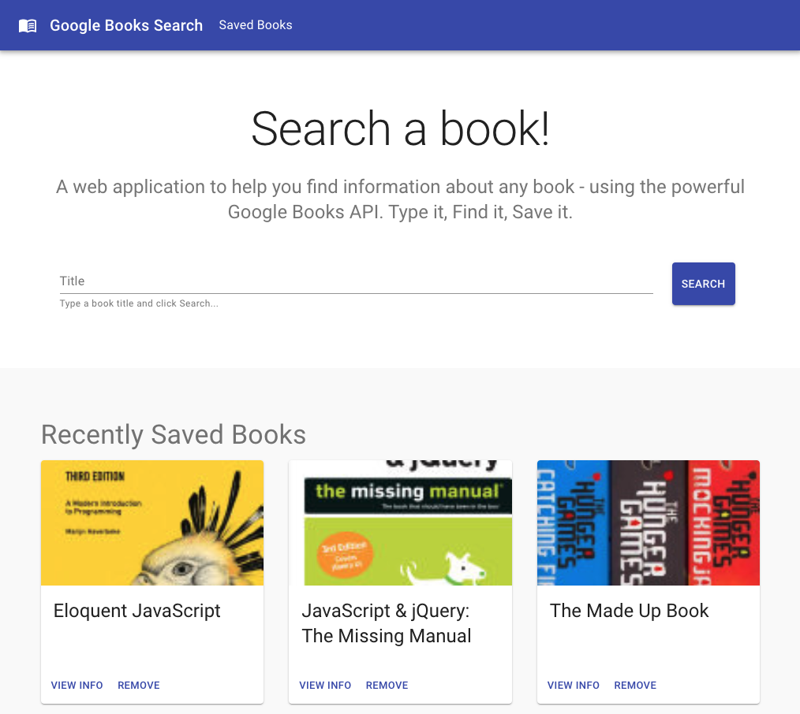
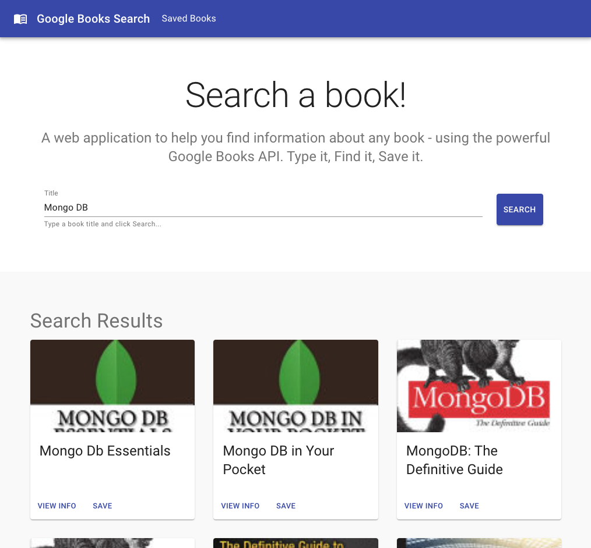
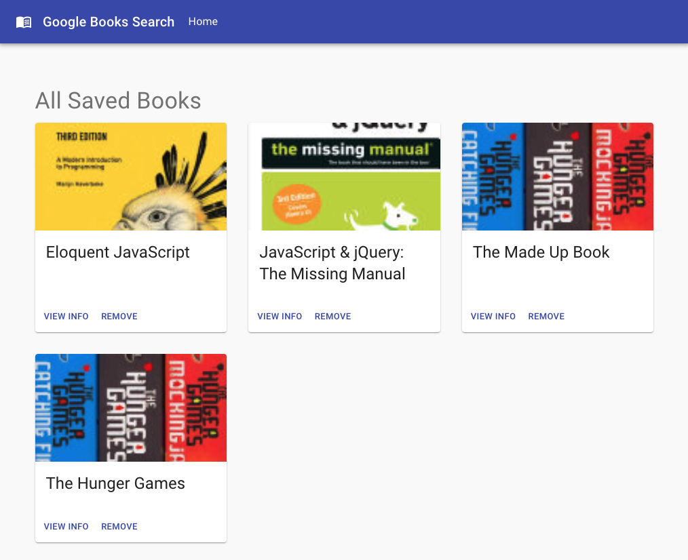

# GOOGLE_BOOKS_SEARCH

A  React-based Google Books Search app. Including React components, helper/util functions, and utilizes React lifecycle methods to query and display books based on user searches. The application is also supported by a Express + Mongo DB backend to allow user to save books to consult or buy later.

## Technologies

1. **Node JS**
2. **MongoDB**
3. **Mongoose**
4. **Express**
5. **React**
6. **React Router**
7. **Redux**
8. **Material UI**

## Instructions

Clone this repo and follow these steps:
1. run `npm install` (install dependencies) for both: root directory (backend dependencies) and client directory (react app dependencies)

2. Ensure you have Mongo installed and server up and running.

3. Create a Mongo DB named: `googlebooks`

4. This app comes equipped with a DB Seeder that will connect to the DB and pre-load some sample data.

5. `Redux Dev Tools` will monitor state changes and allow you to use redux dev tools extension for GUI of state and actions. Make sure you have redux dev tools extension installed when running locally.

6. `Concurrently` pkg will start both, backend and fronted apps when running `npm start` at the app's root directory.

7. a Book Schema contains the following:
* `title` - Title of the book from the Google Books API

* `authors` - The books's author(s) as returned from the Google Books API

* `description` - The book's description as returned from the Google Books API

* `image` - The Book's thumbnail image as returned from the Google Books API

* `link` - The Book's information link as returned from the Google Books API

8. Backend REST API routes available:
* `/api/books` (get) - Should return all saved books as JSON.

* `/api/books` (post) - Will be used to save a new book to the database.

* `/api/books/:id` (delete) - Will be used to delete a book from the database by Mongo `_id`.

## Deployed App (Heroku + Mongo Atlas)

* [Heroku Link](https://gbook-searchapp.herokuapp.com/)

App Home Page:
- The App's Home Page allows user to search books, and it also displays last 5 saved books.

Search Results:
- Displaying book card components with search results.

Saved Books:
- Displaying book card components with search results.

## Contributing

1. Ariel Cuesta

## Tests

Testing has not been incorporated at the moment.

## License

MIT

## Questions

Want to get in touch? Github: arielcc88
Report bugs and enhancements to: arielcc88@gmail.com 